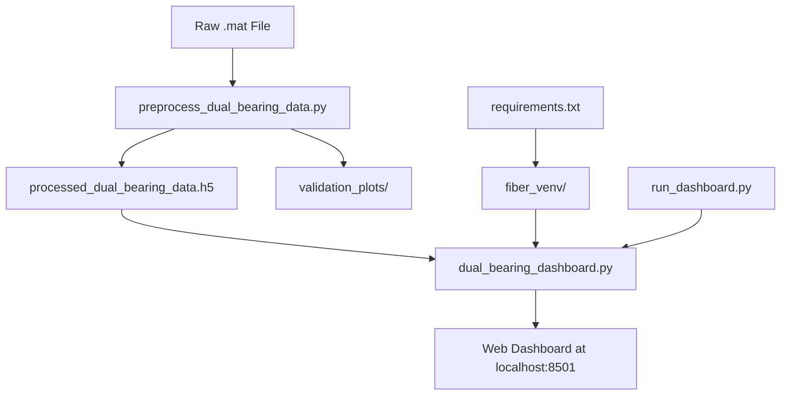

# 📁 Project Structure - Dual Bearing Fiber Sensor Dashboard

## Clean Codebase Organization

```
fiber-dashboard-sensing360/
├── 📋 Core Files
│   ├── requirements.txt                     # Python dependencies (10 lines)
│   ├── README.md                           # Complete documentation (232 lines)
│   └── project_structure.md               # This file - project organization
│
├── 🔧 Data Processing
│   ├── preprocess_dual_bearing_data.py    # Main preprocessing script (332 lines)
│   └── optics11_recording_*.mat           # Raw fiber sensor data (25MB)
│
├── 📊 Dashboard Application
│   ├── dual_bearing_dashboard.py          # Main Streamlit dashboard (485 lines)
│   └── run_dashboard.py                   # Dashboard runner script (81 lines)
│
├── 📈 Generated Data & Outputs
│   ├── processed_dual_bearing_data.h5     # Processed HDF5 data (50MB)
│   └── validation_plots/                  # Validation outputs
│       ├── fft_validation_plot.png        # FFT validation visualization
│       └── sensor_layout.png              # Sensor position layouts
│
└── 🐍 Environment
    └── fiber_venv/                         # Python virtual environment
        ├── bin/                            # Executables (Unix/Mac)
        ├── lib/                            # Installed packages
        └── pyvenv.cfg                      # Environment configuration
```

## File Purposes

### Core Application Files

| File | Purpose | Lines | Description |
|------|---------|-------|-------------|
| `dual_bearing_dashboard.py` | Main App | 485 | Streamlit dashboard with animated bearing visualizations and FFT analysis |
| `preprocess_dual_bearing_data.py` | Data Pipeline | 332 | Converts .mat files to optimized HDF5 format with FFT analysis |
| `run_dashboard.py` | Helper Script | 81 | Convenience script to launch dashboard with environment checks |

### Configuration & Documentation

| File | Purpose | Lines | Description |
|------|---------|-------|-------------|
| `requirements.txt` | Dependencies | 10 | Python package versions for reproducible environment |
| `README.md` | Documentation | 232 | Complete setup, usage, and technical documentation |
| `project_structure.md` | Organization | - | This file - explains project structure |

### Data Files

| File | Type | Size | Description |
|------|------|------|-------------|
| `optics11_recording_*.mat` | Input | 25MB | Raw fiber sensor data from dual bearings |
| `processed_dual_bearing_data.h5` | Output | 50MB | Optimized HDF5 format with FFT analysis |

## Workflow



## Quick Commands

```bash
# Setup environment
python -m venv fiber_venv
source fiber_venv/bin/activate
pip install -r requirements.txt

# Process data
python preprocess_dual_bearing_data.py

# Run dashboard
python run_dashboard.py
# OR
streamlit run dual_bearing_dashboard.py
```

## Removed Files (Cleanup)

The following files were removed during refactoring:
- ❌ `preprocess_dual_bearing_simple.py` - Backup version (compatibility workaround)
- ❌ `process_fos_data.py` - Original example (superseded)
- ❌ `sensor_info.csv` - Sensor data (now embedded in preprocessing)
- ❌ `test_sensing360_Data.py` - Exploration script (no longer needed)
- ❌ `streamlit_visualisation.py` - Single bearing example (replaced)

## Benefits of Refactored Structure

✅ **Simplified**: Only essential files remain  
✅ **Clear Purpose**: Each file has a distinct, well-defined role  
✅ **Easy Maintenance**: Logical organization for future updates  
✅ **Documentation**: Complete setup and usage instructions  
✅ **Reproducible**: Virtual environment with pinned dependencies  
✅ **Efficient**: Optimized data format for fast dashboard loading  

---

*Last updated: Project refactoring - January 2024* 